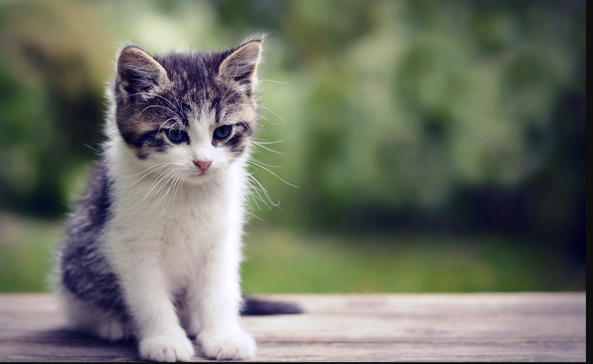

### Hi Im Anna  👋
#### About me

 My perant own a farm, its in south head. On our farm we have free range chickens, a cat and a lot of horses. I have a horse called Rose which I like to ride around on the farm with my brother and also take horse riding lessons with a gril called Natily. Our cat has a very unusual name called Other Cat because she was a stray and we called her the other cat, as we originally had another stray called Puss Puss and she turned up later.  Puss Puss and Other Cat looked almost exactly the same with green eyes and black fur so we called the new cat, the Other Cat to identify her from Puss Puss. Sadly Puss Puss died of Cancer but Other Cat still lives to this day. 

HOBBIES/ WHAT I LIKE.
I like my computure and being on-line, watching You-Tube, playing Minecraft and other on-line games with my friends. I also love going to the beach, kayaking, drawing/art, anime, looking after my animals and horse riding.
 

#### why I choose digital tech
Because I really like digy tech and I want to get better at computers and coding. Also my dad does coding and makes apps.

#### Aspirations

- I want to create apps
- Some more 3D printting

<!--
**Annawscw/Annawscw** is a ✨ _special_ ✨ repository because its `README.md` (this file) appears on your GitHub profile.

Here are some ideas to get you started:
(image.jpg)

- 🔭 I’m currently working on ...
- 🌱 I’m currently learning ...
- 👯 I’m looking to collaborate on ...
- 🤔 I’m looking for help with ...
- 💬 Ask me about ...
- 📫 How to reach me: ...
- 😄 Pronouns: ...
- ⚡ Fun fact: ...
-->
